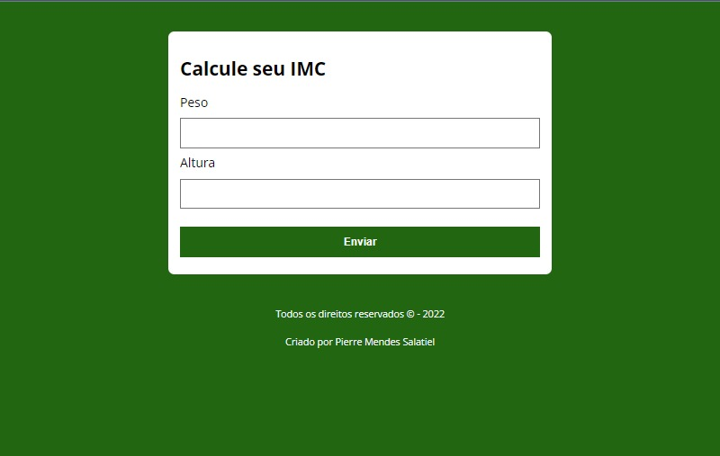

# Bem Vindos ao projeto Calculadora de IMC
>Este Projeto, foi criado com intuito de aplicar meus estudos em JavaScript, e adicionar mais um projeto ao meu portifólio. O objetivo era construir uma calculadora de IMC simples. Este projeto utiliza as seguintes tecnologias: HTML, CSS e JavaScript.

 

## Instalação e uso

```sh
git clone https://github.com/Pierre-Mendes/CalculadoraIMC.git
```
## Autor
​
👤 **Pierre Mendes Salatiel**
​
* Website: https://pierre-mendes.github.io/MyLinkTree-Instagram-Bio/
* Github: [@Pierre-Mendes](https://github.com/Pierre-Mendes)
* LinkedIn: [@pierre-mendes-salatiel](https://linkedin.com/in/pierre-mendes-salatiel)

## Apoie este projeto
​
Favorite este repositório ⭐️ se este projeto ajudou você!